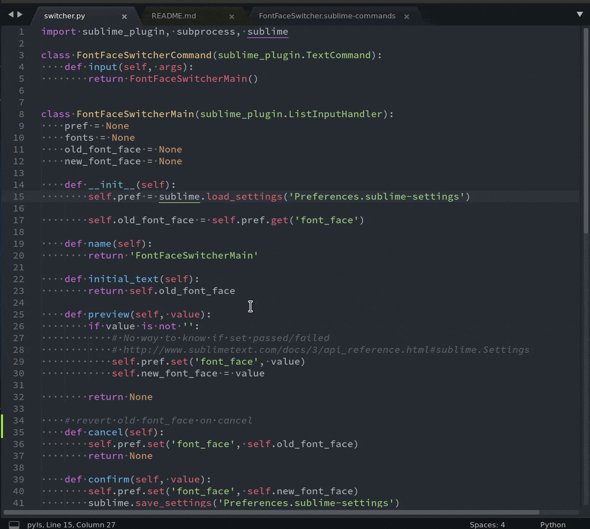

FontSwitcher
---

> Interactively switch font in SublimeText.

### Features
- List and fuzzy find installed fonts.
- Live preview your font.

### Usage
<kbd>Ctrl</kbd>+<kbd>Shift</kbd>+<kbd>P</kbd> to bring up the `Command Pallet` and look for `Font switcher`.

### Demo

### Installation

Currently not published to [packagecontrol.io](https://packagecontrol.io/), you can install by:

1) Cloning this repo to `~/.config/sublime-text-3/Packages`
> git clone https://github.com/pjmp/FontSwitcher.git

2) Download this project and extract to `~/.config/sublime-text-3/Packages`